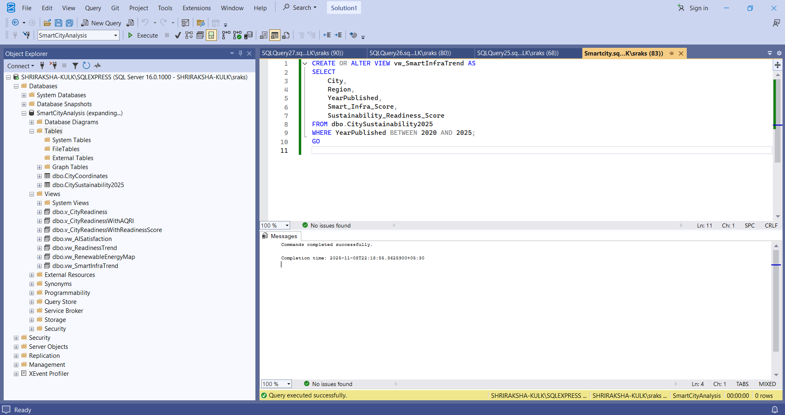
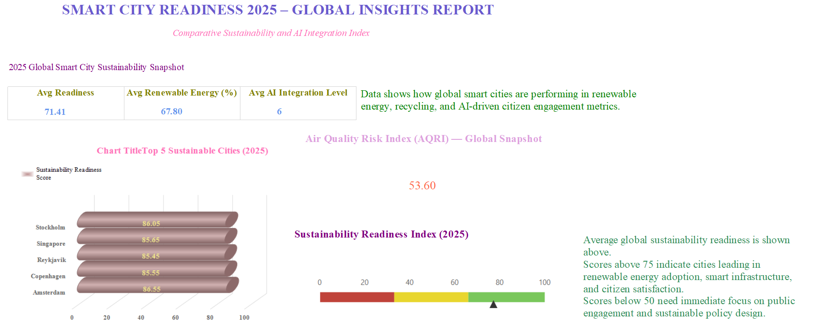
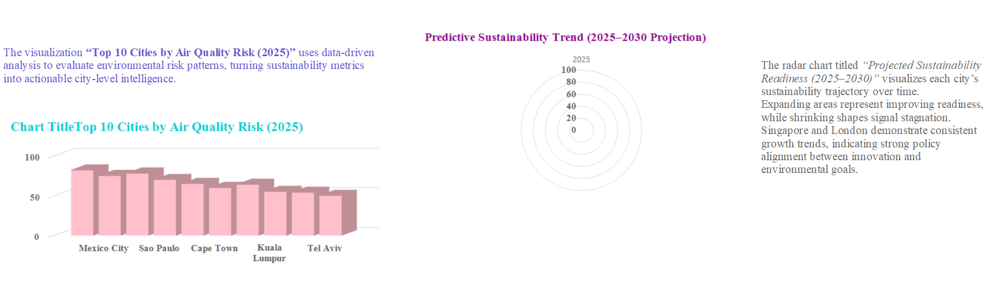
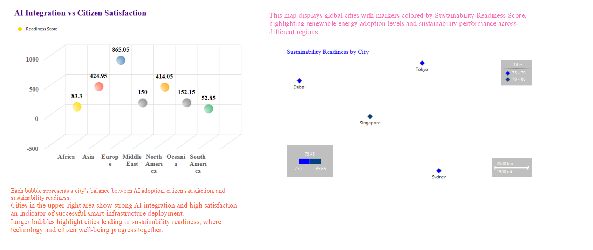

# SMART CITY READINESS 2025 – GLOBAL INSIGHTS REPORT  

**Comparative Sustainability and AI Integration Index Dashboard**  

This project showcases a professional SSRS (SQL Server Reporting Services) dashboard titled **"Smart City Readiness 2025 – Global Insights Report"**, designed to present key sustainability, renewable energy, and AI integration metrics of global smart cities.  

Built using **Microsoft SQL Server** and **Report Builder**, this dashboard visualizes insights into how cities across regions are adapting to sustainability goals and AI-driven urban solutions.  

---

## Project Overview  

The **Smart City Readiness 2025 Report** is an analytical dashboard created in **Microsoft Report Builder (.rdl)** format. It integrates SQL datasets with advanced SSRS visual elements including KPI cards, charts, gauges, and maps to deliver actionable insights on smart city performance.  

The report provides a detailed look at metrics like:  
- Average Readiness Score  
- Renewable Energy Adoption (%)  
- AI Integration Levels  
- Air Quality Risk Index (AQRI)  
- Citizen Satisfaction and Regional Insights  

The layout is visually optimized for executive presentations and sustainability analytics.  

---

## Key Objectives  

- To measure **global smart city sustainability** and readiness performance.  
- To analyze **renewable energy adoption** and **AI integration** across cities.  
- To visualize **air quality risks** and **citizen satisfaction** using interactive charts.  
- To design a **data-driven SSRS dashboard** with clarity and analytical storytelling.  

---

## Tools & Technologies  

| Tool | Purpose |
|------|----------|
| **Microsoft SQL Server (SSMS)** | Data preparation, KPI calculation, and queries |
| **Microsoft Report Builder (SSRS)** | Dashboard design and report visualization |
| **SQL Queries** | Computed average readiness, energy, and integration levels |
| **Export Options** | Report exported as PDF for presentation and portfolio |

---

## Dashboard Overview  

Below are the final SSRS report visuals created for the **Smart City Readiness 2025 – Global Insights Report**.  

### 🖥️ SSMS Data Preparation  

---

### 🌍 Global Sustainability Snapshot  

This section includes:  
- **KPI Cards** displaying Average Readiness (71.41), Renewable Energy (67.80%), and AI Integration Level (6).  
- **Bar chart** showing top 5 sustainable cities (Stockholm, Singapore, Reykjavik, Copenhagen, Amsterdam).  
- **AQRI Metric (53.60)** indicating global air quality risk.  
- **Gauge chart** showing sustainability readiness index levels.  

---

### 🌿 Air Quality and Sustainability Trends  

This section contains:  
- **Top 10 Cities by Air Quality Risk (2025)** showing environmental vulnerability rankings.  
- **Radar chart** for *Projected Sustainability Readiness (2025–2030)* visualizing trajectory of readiness growth.  

---

### 🤖 AI Integration vs Citizen Satisfaction  

This section visualizes:  
- **Bubble chart** showing balance between AI adoption and citizen satisfaction across continents.  
- **Map visualization** highlighting readiness scores and renewable energy levels per region.  

---

## Report Export Instructions  

To export the SSRS report as a PDF:  
1. Open in **Microsoft Report Builder**.  
2. Click **Run** to preview the full dashboard.  
3. Select **Export → PDF** from the toolbar.  
4. Save as `SmartCitySustainability_2025_Report.pdf`.  

---

## Insights and Learnings  

- Highlights **comparative city performance** across sustainability, AI, and renewable adoption metrics.  
- Demonstrates **SSRS dashboard design** and effective storytelling using data.  
- Reflects ability to build **real-world analytical reports** for executive presentation.  
- Offers a scalable model for **smart city analytics and sustainability tracking**.  

---

### Author  
**Shriraksha Kulkarni**  
- [LinkedIn](https://www.linkedin.com/in/shriraksha-kulkarni-1120b92b9/)  
- [GitHub](https://github.com/raksha408)
